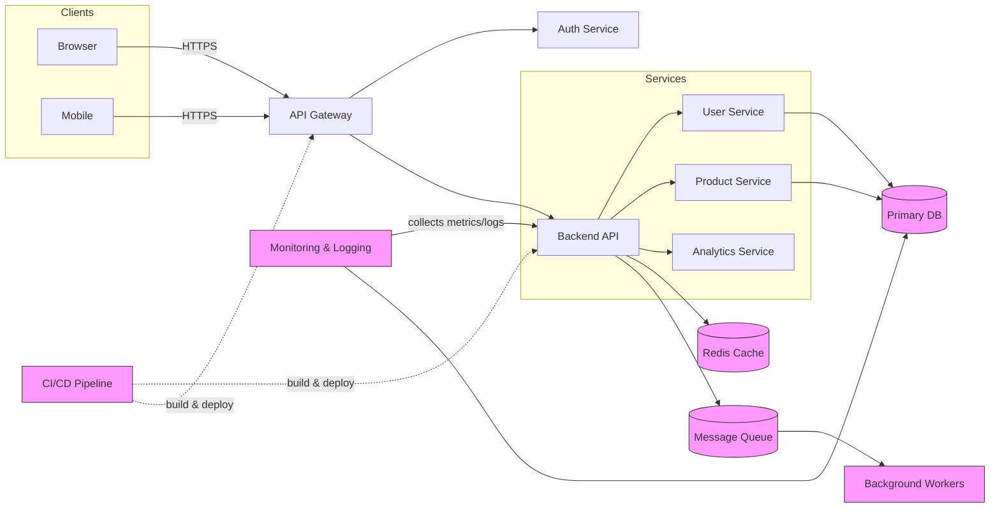

# Architecture Overview

This document provides a high-level architecture overview for the project.

Legend:
- API Gateway: entry point for HTTP/HTTPS requests
- Auth Service: authentication/authorization (OAuth, JWT)
- Backend API: business logic and orchestration
- Services: domain microservices (users, products, analytics)
- Redis Cache: caching layer for hot data
- Message Queue: asynchronous processing (e.g., RabbitMQ, Kafka)
- Background Workers: process queued jobs
- CI/CD: build, test, and deployment pipeline
- Monitoring & Logging: observability (Prometheus, Grafana, ELK)

Suggested next steps:
1. Add service-specific diagrams (sequence diagrams or component diagrams).
2. Link real documentation pages for each component.
3. Include network/security boundaries (VPC, subnets, WAF, rate limiting).
